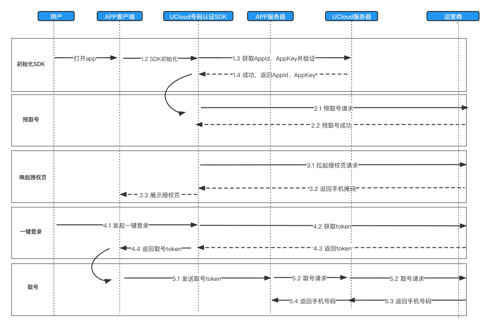

# 一键登录系统交互流程

## 一键登录
系统交互流程主要分为四个步骤：  
第一步，SDK本地初始化.    
第二步，开始预取号，得到手机号掩码（150****9999），调起授权页.      
第三步，用户确认授权。  
第四步，发送取号token。
第五步：返回用户明文手机号.   

### 1 初始化
1.1 用户打开APP，并访问相关页面     
1.2 调用sdk接口获取版本号、及进行终端网络环境判断       

### 2 预取号，调起授权页
2.1 第一步成功后，调用SDK接口唤起授权页面   
2.2 SDK会先请求手机号掩码（150****9999）
2.3 掩码获取成功后，在授权页面展示掩码及运营商协议供终端用户确认      

**注意事项：     
1、一键登录需用户确认授权方可使用，开发者不得通过任何技术手段跳过或模拟此步骤，否则我方有权停止服务并追究相关法律责任。       
2、登录按钮文字描述必须包含“登录”或“注册”等文字，不得诱导用户授权。       
3、您接入我们的SDK并成功上线后，我方会对上线的应用授权页面做审查，如果有出现未按要求弹出或设计授权页面的，将关闭应用的一键登录服务。待您修改无误后，再重新开启。     
4、为减少授权页唤起的等待时间，可预先判断用户是否需要进行登录或注册，提前调用预取号接口，供后续流程使用。**       

### 3 用户确认，授权并登录    
3.1 用户确认授权页面的内容，同意相关协议        

### 4 发起取号token
4.1  点击授权页面的登录或注册按钮，SDK发起本次取号的Token获取      
4.2 成功后将Token返回给APP      

### 5 获取客户明文手机号
5.1 APP将获得的取号Token传递至应用服务端
5.2 应用服务端携带Token调用易盾号码认证服务端一键登录取号API接口
5.3 Ucloud服务端取得明文号码后，将号码返回给App服务端
